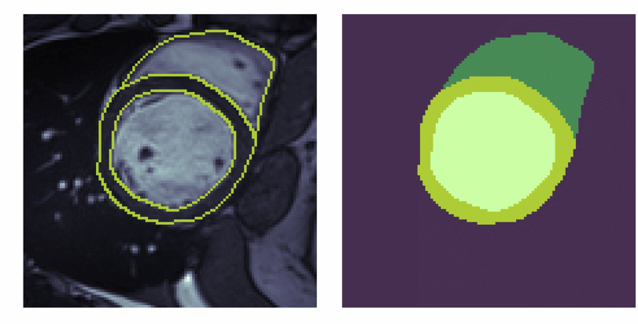
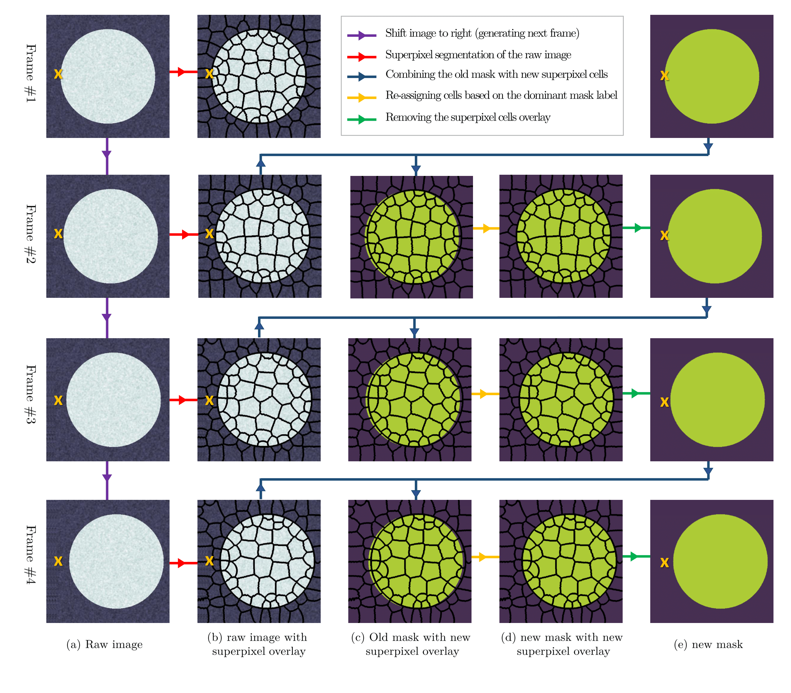
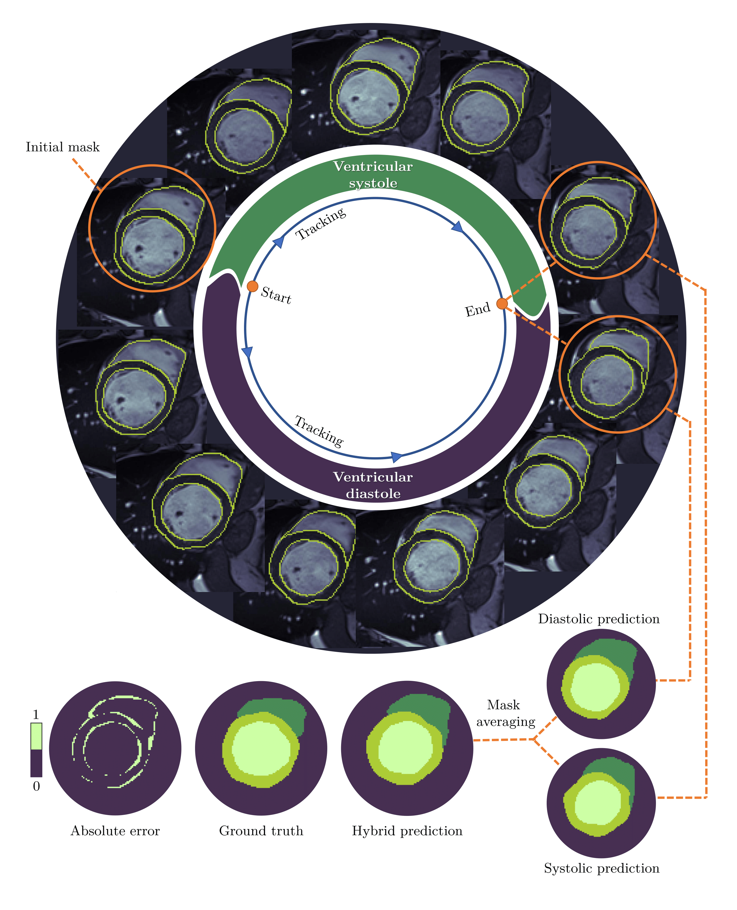

# VentricleTrack
## Temporal extrapolation of heart wall segmentation in cardiac magnetic resonance images via pixel tracking
See the paper on [Arxiv](https://arxiv.org/abs/2208.00165).

In this repository, we have tailored a pixel tracking method for temporal extrapolation of the ventricular segmentation masks in cardiac magnetic resonance images. The pixel tracking process starts from the end-diastolic frame of the heart cycle using the available manually segmented images to predict the end-systolic segmentation mask. The superpixels approach is used to divide the raw images into smaller cells and in each time frame, new labels are assigned to the image cells which leads to tracking the movement of the heart wall elements through different frames. The tracked masks at the end of systole are compared with the already available manually segmented masks and dice scores are found to be between 0.81 to 0.84. Considering the fact that the proposed method does not necessarily require a training dataset, it could be an attractive alternative approach to deep learning segmentation methods in scenarios where training data are limited. Here, you can see an example result which is reproducible using the presented code: 

## How it workes?
In this method, we initially extract the superpixels cells of the raw image. Then by overlaying the segmentation mask from the previous frame on top of the superpixels cells of the current frame, we decide that each of the cells belongs to which label. To assign a uniform label value to each of the current frame cells, the most repeated label value of the previous mask in each of the cells is calculated. This basically means that if the majority of the cell is occupied by a label, we assign that value to the whole cell. As far as spatial changes from one frame to another are not larger than the average size of the cells, the method is promising to work. 

Considering the fact that the heart moves in a periodic cycle, there are two pathways in the time domain that we can follow to reach from the end of diastole to the end of systole. The apparent choice is to track the heart ventricular movement in the same direction as time passes, and the second choice is to assume that the frames are happening in the reverse order. These two pathways lead to two different pixel tracking results for the end of systole as illustrated in Figure below. To improve the predictions, these two approximations can be combined to make an averaged mask and help to reach a more generalized result, which is possibly less dependent on the sequence of the tracked frames. 

## How to run the code
The code is written with MATLAB R2021a with the help of image processing toolbox. Just run the Main.m in your code editor. The output files will be automatically generated including the gif video above. To use the code on your own data, you need to replace the M and B matrices which respectively show the raw cine MRI image for all time steps and the segmentation mask at end diastole. Also, variable ES within the Main.m needs to be replaced with your end-systolic time frame. More details are commented within the file. 

## Citation
Arash Rabbani; Hao Gao; Dirk Husmeier, Temporal extrapolation of heart wall segmentation in cardiac magnetic resonance images via pixel tracking, Proceedings of the 4th International Conference on Statistics: Theory and Applications (ICSTA'22), Prague, Czech Republic – July 28- 30, 2022.

